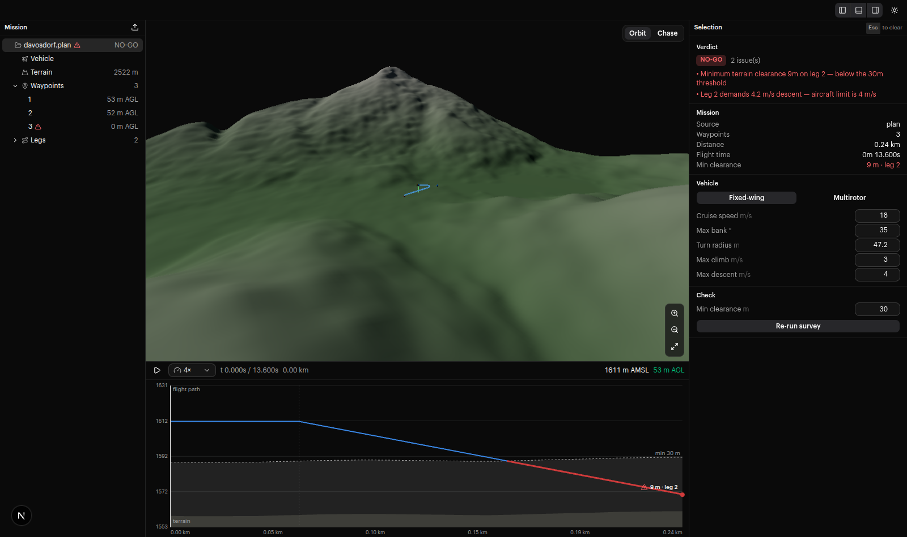
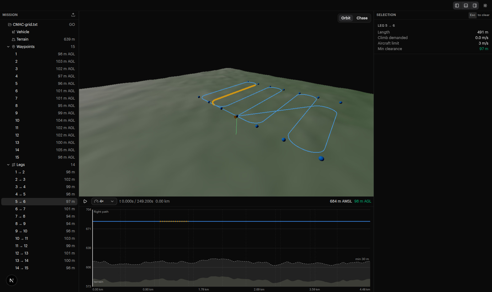
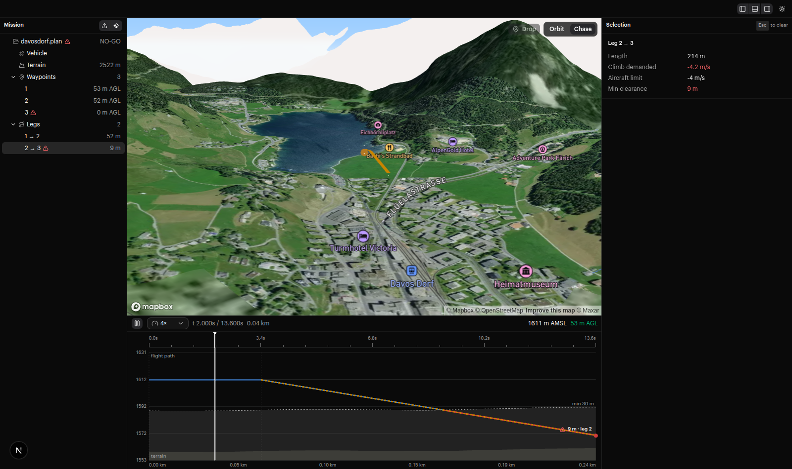
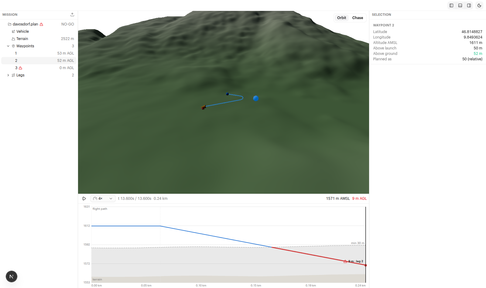

# dry run

**Know before you fly.**

Check a drone route against real terrain.



## See the risk

Red is too low. Green is clear.



## Fly the route

Press play. Scrub the chart. Chase the drone.



## Make a plan

Drop points on the map. Move them. Delete them.

Each change gets a new **GO** or **NO-GO** check.



## Run it

You need a [Mapbox token](https://account.mapbox.com/access-tokens/) for real terrain.

```bash
pnpm install
echo 'MAPBOX_TOKEN=pk.your_token' > .env.local
pnpm dev
```

The desktop app opens. The token is baked in at build time; to override it on a machine, put `{"mapboxToken": "pk.…"}` in `settings.json` in the app's user data folder (`~/.config/dry-run` on Linux, `%APPDATA%\dry-run` on Windows). Terrain tiles are cached in the same folder, so areas you've checked once load offline.

Drop in an ArduPilot `.waypoints` file or a QGroundControl `.plan` file. Try one from [`samples/`](samples/).

```bash
pnpm test
```

Want the flight math? Read [`DESIGN.md`](DESIGN.md).

## Build installers

```bash
pnpm dist
```

Builds for the OS you run it on, into `release/`: `dry-run-<version>.AppImage` on Linux, `dry-run-setup-<version>.exe` on Windows. The token in `MAPBOX_TOKEN` (env or `.env.local`) is baked in. Both register `.plan` and `.waypoints` files, so double-clicking one opens it in dry run.

To publish a release, bump `version` in `package.json`, commit, then tag and push:

```bash
git tag v0.1.0 && git push origin main v0.1.0
```

The **Desktop builds** workflow builds both installers and attaches them to a GitHub release for that tag. It needs a `MAPBOX_TOKEN` repository secret. The Windows installer can't be built on Linux without Wine, so locally it builds only on Windows.

On Linux, `chmod +x` the AppImage and run it. It needs `fusermount3` (in the `fuse3` package, standard on Ubuntu desktops).

## Connect an ArduPilot vehicle

The app talks MAVLink itself; nothing else to install. It listens on UDP `127.0.0.1:14550`, the port SITL and ground stations (Mission Planner, QGroundControl, MAVProxy) forward to. For a telemetry radio, let your ground station forward to that port.

Start SITL. On the current WSL setup:

```bash
/root/tools/ardupilot-sitl/start.sh
```

In the inspector's **Vehicle** area, click **Connect MAVLink**. **Locate vehicle** loads terrain at its reported position and shows a teal live-position marker. **Download mission** imports the autopilot's mission into the terrain checks and selects the matching profile for Copter or Plane. The 3D aircraft and timeline remain the predicted mission playback; the teal marker is the live vehicle's map position.

Telemetry updates twice a second. A missing heartbeat for five seconds shows **Signal lost** and removes live data. **Disconnect** closes the UDP port so other tools can use it. If another program already holds port `14550`, Connect says so.

Mission download currently supports ArduPilot, `MISSION_ITEM_INT`, and up to 512 mission items, with retries and a 20-second transfer deadline. ArduPilot item zero supplies home when `HOME_POSITION` is unavailable. Relative altitudes use the autopilot home elevation; imported files continue to use terrain-derived launch elevation. Unknown coordinate frames fail the download rather than being guessed. Existing mission-parser warnings about omitted commands still apply.

This integration reads telemetry and downloads missions. Mission upload and flight commands are not exposed. The bridge lives in `electron/mavlink.ts`; `pnpm test` covers it, including a UDP round trip against a fake autopilot.
